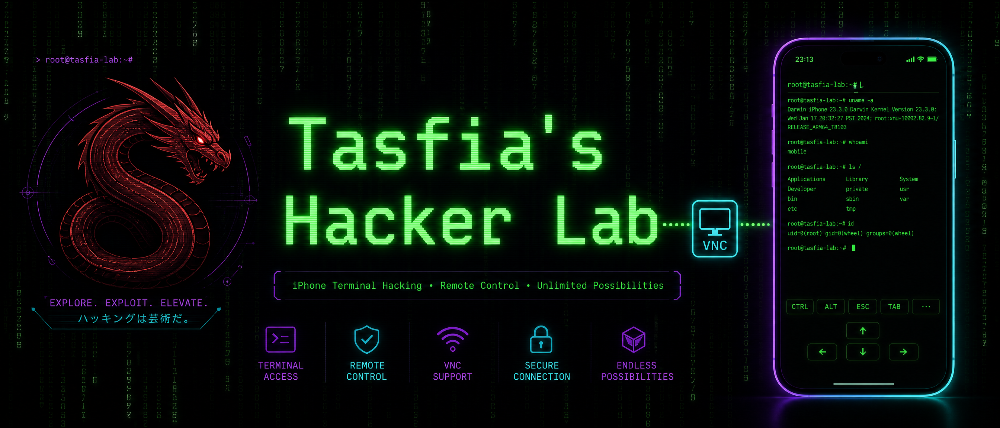
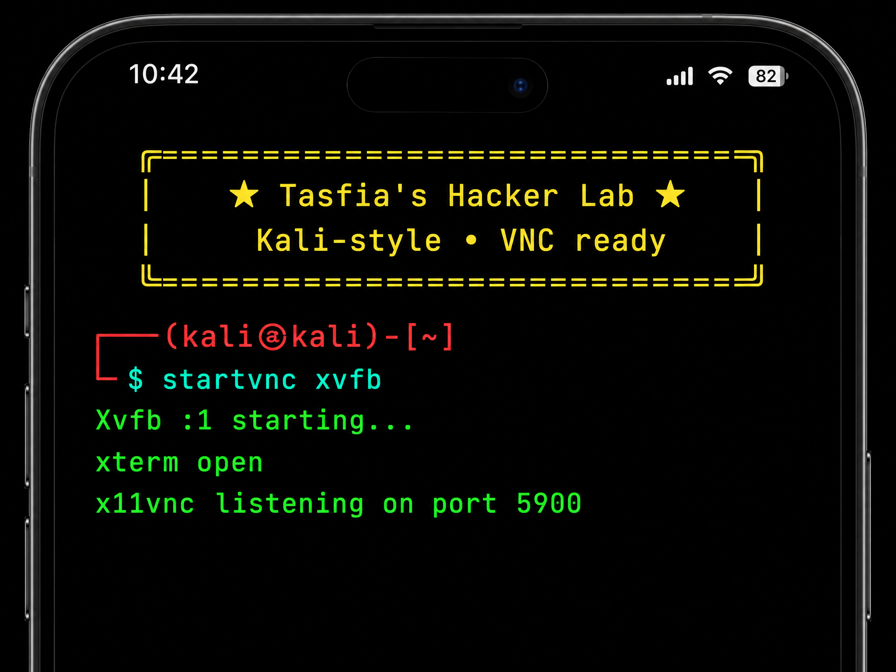
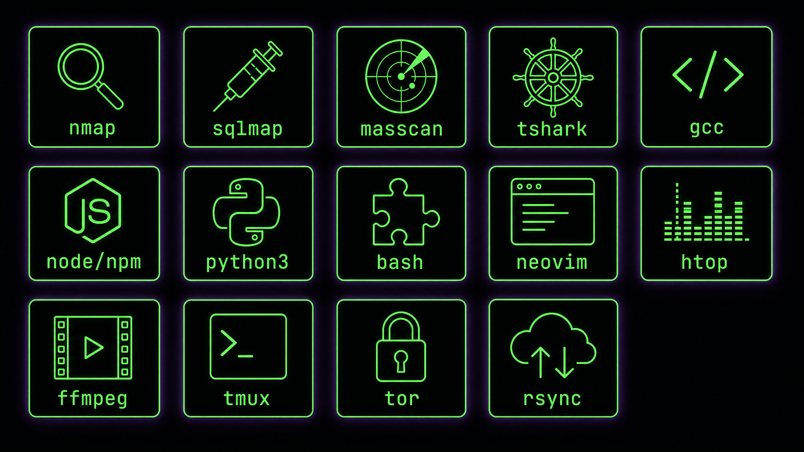

<p align="center">
  
</p>

# Tasfia's Hacker Lab 🐉

> **Kali-style Alpine Linux on iPhone/iPad — a pre-built rootfs with VNC, zero install steps.**

<div align="center">

| ⚙️ Base | 📦 Packages | 🖥️ Commands | 🔓 Missing deps |
|---|---|---|---|
| Alpine 3.14 x86 (musl) | 225+ APK | 925+ executables | **0** |

[](https://ish.app)
[]()
[]()

</div>

---

## ✨ Why this project?

Inside the iSH app, `apk install` is painfully slow (everything runs through emulation). This project solves that by **pre-building everything** — you just extract the tar.gz and everything is already installed. The VNC server is also pre-installed, so one command gives you a full desktop on your iPad.

<p align="center">
  
</p>

## 🚀 Setup in 5 minutes

| Step | Action |
|---|---|
| 1️⃣ | Open iSH → **Settings → Filesystems** |
| 2️⃣ | **Delete** any existing rootfs |
| 3️⃣ | **Import** → select `kali-vnc-prebuilt-ish.tar.gz` |
| 4️⃣ | Mount point = `/` |
| 5️⃣ | In the terminal, run: `startvnc xvfb` |
| 6️⃣ | In the bVNC app: **Host = 127.0.0.1**, **Port = 5900** (in separate fields) |

> 💡 **Remember:** keep the iSH app in the foreground (VNC sleeps when iSH is backgrounded). To stop: `startvnc stop`
> ⚠️ Keep ~4 GB of free space on your device (extracted size ≈ 2.6 GB)

<p align="center">
  
</p>

## 🛠️ What's included? (925+ commands)

<p align="center">
  
</p>

For the full list, see: [`TOOLS-v7.md`](TOOLS-v7.md)

| Category | Sample tools |
|---|---|
| 🕵️ Pentest | `nmap` • `masscan` • `sqlmap` • `nikto` • `zmap` • `tshark` • `tcpdump` • `radare2` • `strace` • `ltrace` • `dnsrecon` • `macchanger` • `proxychains` • `tor` • `sshpass` |
| 💻 Development | `gcc` • `g++` • `node`/`npm` • `python3`/`pip3` • `ruby` • `perl` • `lua5.3` • `tcl`/`expect` • `make` • `cmake` • `meson` • `gdb` • `valgrind` • `git` |
| ✏️ Editors | `vim` • `neovim` • `nano` • `micro` • `emacs` • `joe` • `vis` • `mg` • `bvi` • `hexedit` |
| 🐚 Shells | `bash` (+completion) • `zsh` • `fish` • `tcsh` • `dash` |
| 📊 Monitoring | `htop` • `atop` • `sysstat` • `iftop` • `nethogs` • `ncdu` • `tmux` |
| 🎵 Media | `ffmpeg` • `mpv` • `sox` • `lame` • `flac` • `cmus` • `mpd` • `imagemagick` |
| 🌐 Network | `curl` • `wget` • `lynx` • `w3m` • `links` • `smbclient` • `sshfs` • `openvpn` • `wireguard` • `rdesktop` • `aria2` • `lftp` |
| 🖥️ X11/VNC | `Xvfb` • `xterm` • `x11vnc` • `twm` • `openbox` • `xeyes` • `xclock` • `cmatrix` |

## 🐍 Pre-installed Python packages

`scapy` • `impacket` • `pyftpdlib` • `pysocks` • `psutil` • `requests` • `flask` • `tornado` • `pytest` • `pyyaml` • `beautifulsoup4` • `paramiko` • `cryptography` + `pip3` for more

## 🎨 Tasfia's Banner

Every new shell prints a colored welcome box:

```
  ╔═══════════════════════════════════════════╗
  ║  ★  Tasfia's Hacker Lab ★                  ║
  ║  Kali-style • VNC ready                   ║
  ╚═══════════════════════════════════════════╝
```

Want a different name or colors? Edit `/root/.tasfia_banner`. You can also generate your own ASCII art with `figlet -f slant "your name"` (376 fonts included).

## 🔧 Startup modes

| Mode | Command | What it does |
|---|---|---|
| Raw framebuffer | `startvnc` | x11vnc in rawfb mode — the fastest, no X server needed |
| Full X server | `startvnc xvfb` | Xvfb + xterm + x11vnc — a full desktop experience |
| Stop | `startvnc stop` | Kills all VNC processes |

## ⚠️ Known limitations

- iSH is an x86 user-mode emulator — no GPU, no JIT, so some things run slowly
- `java` / `metasploit` / `Burp Suite` / Debian-based distros are **impossible** on iSH
- No kernel access — and `john`, `hydra`, `ffuf`, `gobuster` are not in the Alpine 3.14 repos
- Set a VNC password on public networks: `startvnc xvfb --pass YOURPASS`

## 📦 Repository contents

```
kali-vnc-prebuilt-ish.tar.gz     # Pre-built rootfs (extract and run)
TOOLS-v7.md                      # Complete categorized tool list
README.md                        # This file
images/                          # Banners and demo artwork
```

---

<div align="center">

**Made for Tasfia** 💚 — *Explore. Exploit. Elevate.*

</div>
